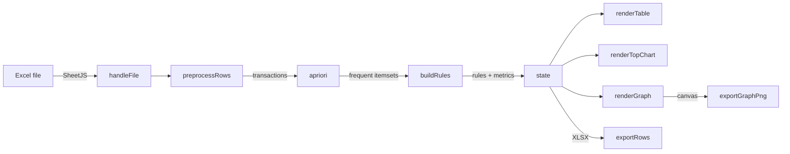

# Association Rules Studio

A single-file, fully client-side web application for **market-basket / association-rule
mining** on Excel data. Load a workbook, mine frequent itemsets with **Apriori**, generate
association rules with a full suite of interestingness metrics, then explore everything
through a sortable table, a Top-20 cost chart, and an interactive force-directed rule
network — all in a dark, "deep space" UI.

It is a browser port of the Python tool `AssociationRulesGUI.py`. There is **no server, no
build step, no installation, and no `mlxtend` dependency** — the Apriori algorithm,
frequent-itemset generation, and rule generation are implemented from scratch in plain
JavaScript. Open the HTML file and it runs, fully offline.

[](https://github.com/Adelsdorfer/Association-Rules-Studio/blob/main/LICENSE)


---

## Table of contents

- [Features](#features)
- [Screenshots / UI overview](#screenshots--ui-overview)
- [Quick start](#quick-start)
- [Input data format](#input-data-format)
- [Using the app](#using-the-app)
  - [1. Load a workbook](#1-load-a-workbook)
  - [2. Set thresholds](#2-set-thresholds)
  - [3. Text filters (before analysis)](#3-text-filters-before-analysis)
  - [4. Run the analysis](#4-run-the-analysis)
  - [5. Explore the results](#5-explore-the-results)
  - [6. Export](#6-export)
- [Metrics explained](#metrics-explained)
- [The rule graph](#the-rule-graph)
- [Filter presets](#filter-presets)
- [Output columns](#output-columns)
- [How it works (architecture)](#how-it-works-architecture)
- [Project structure](#project-structure)
- [Configuration & persistence](#configuration--persistence)
- [Design system](#design-system)
- [Privacy & security](#privacy--security)
- [Browser support](#browser-support)
- [Performance notes](#performance-notes)
- [Known limitations & quirks](#known-limitations--quirks)
- [Development](#development)
- [Contributing](#contributing)
- [Third-party software](#third-party-software)
- [License](#license)
- [Contact](#contact)

---

## Features

- **Zero install, fully offline.** One `index.html` plus two vendored libraries. No server,
  no bundler, no Node, no network calls.
- **Excel in, Excel out.** Reads `.xlsx`/`.xls` with [SheetJS](https://sheetjs.com/) and
  exports rules back to `.xlsx`.
- **From-scratch Apriori.** Frequent-itemset mining with the classic join-and-prune
  candidate generation, bounded by a configurable maximum itemset size.
- **Full metric suite.** Support, confidence, lift, leverage, conviction, Zhang's metric,
  combination count, and cost-based metrics.
- **Cost awareness.** Optional consumption and price columns are turned into **unit prices**
  and aggregated into antecedent/consequent/weighted cost metrics.
- **Interactive results table.** Sortable columns, quick search, a configurable set of
  visible metric columns, and a row limit.
- **Top-20 cost chart.** Horizontal bar chart of the highest weighted consequent costs;
  click a bar to jump straight to that combination in the graph.
- **Interactive rule network.** Force-directed D3 graph: nodes are items/itemsets, directed
  edges are rules. Color encodes confidence, width encodes combination count, node size
  encodes frequency. Zoom, pan, drag, click-to-focus, fullscreen, and "open in new tab".
- **PNG export of the graph.** Saves exactly the current viewport as a high-resolution PNG;
  if the graph search box contains a number, it becomes a filename prefix.
- **Filter presets.** Save, load, delete, and share (export/import JSON) reusable filter
  configurations — stored in the browser.
- **Dark "deep space" theme.** Token-driven design, nebula glows, a subtle CSS starfield
  (respecting `prefers-reduced-motion`), and glowing accent controls.
- **Quality-of-life UX.** Collapsible sidebar that auto-collapses after a run, a green
  "ready" status indicator, a live console log, toast notifications, and a searchable
  in-app help modal.

---

## Screenshots / UI overview

The interface is split into two areas:

- **Sidebar (left):** all controls — input file, thresholds, text filters, filter presets,
  and the run/export buttons. Collapsible, and auto-collapses 3 seconds after a successful
  analysis to maximize result space.
- **Workspace (right):** a topbar (dataset name + compact stat chips + status/help), a tab
  bar, and the active panel:
  - **Console** — a timestamped log of every step.
  - **Table** — the generated rules.
  - **Graph & Top 20** — the cost chart and the rule network side by side.

---

## Quick start

```text
1. Download / clone this repository.
2. Open index.html in a modern browser (double-click, or File ▸ Open).
3. Click the Input file picker and choose an .xlsx workbook
   (e.g. the included sample.xlsx).
4. Click "Run analysis".
5. Browse the Table tab, then open "Graph & Top 20".
```

No web server is required — the page works from a `file://` URL because all dependencies
are local. (If your browser restricts `file://` features, you can optionally serve the
folder with any static server, e.g. `python3 -m http.server`, and open
`http://localhost:8000/`.)

---

## Input data format

The first worksheet of the workbook is read with
`XLSX.utils.sheet_to_json(sheet, { header: 1 })`. Columns are interpreted **by position** —
the header names are informational only and may be anything.

| Column | Meaning | Required |
|---|---|---|
| 1 | **Transaction ID** — rows sharing an ID form one transaction (basket) | ✅ |
| 2 | **Item / material** — the item placed in the basket | ✅ |
| 3 | **Order number** — used to build `Mat_combination` and the `unique_ID` | ✅ |
| 4 | **Consumption** — quantity actually used | optional |
| 5 | **Price** — total price; converted to a **unit price** via `price / consumption` when consumption > 0 | optional |

Requirements:

- At least **3 columns** and at least **2 rows** (1 header + 1 data row).
- Empty rows are ignored; items are trimmed and de-duplicated within a transaction.

**Example:**

| TransactionID | Item     | OrderNo | Consumption | Price |
|---------------|----------|---------|-------------|-------|
| 1001          | Filter   | A-100   | 2           | 40    |
| 1001          | Seal     | A-200   | 1           | 5     |
| 1002          | Filter   | A-100   | 0           | 20    |
| 1002          | Motor    | A-300   | 1           | 300   |

Here transaction `1001` contains `{Filter, Seal}` and `1002` contains `{Filter, Motor}`.
The unit price of `Filter` in row 1 is `40 / 2 = 20`.

---

## Using the app

### 1. Load a workbook

Pick a file with the **Input** file selector. The status pill next to "Input" shows the
file name, and the console logs the detected columns. You can also set the **Output file
name** used for the Excel export.

### 2. Set thresholds

| Control | Meaning | Default |
|---|---|---|
| **Min support** | Minimum share of transactions an itemset must appear in (0–1) | `0.003` |
| **Min confidence** | Minimum confidence for a rule to be kept (0–1) | `0.10` |
| **Max. itemset size** | Largest itemset Apriori will build; `0` means no limit | `4` |
| **Table limit** | Maximum number of rows rendered in the table | `5000` |
| **Include consumption = 0** | Keep ordered-but-unused items (consumption ≤ 0) in the analysis | on |

### 3. Text filters (before analysis)

- **Only items containing terms** (*include*) — keep only rows whose item contains at least
  one of the comma-separated terms. **You must enter either none or at least two terms**;
  entering a single term aborts the run with a clear message.
- **Exclude items** — drop rows whose item contains any of the comma-separated terms.

Terms are case-insensitive, comma-separated, and trimmed. After analysis the same
include/exclude terms are also applied to the generated rules (matched against antecedents
and consequents).

### 4. Run the analysis

Click **Run analysis**. The button shows a spinner, the status pill switches away from the
green "ready" state, and progress is streamed to the **Console** tab. On success the table
fills in, the charts render, a toast confirms the rule count, and the sidebar auto-collapses
after 3 seconds.

### 5. Explore the results

- **Table tab** — click a column header to sort (click again to reverse). Use **Quick
  search** to filter antecedents/consequents, toggle which metric columns are visible with
  the metric chips, and click **Show graph** to switch to the network.
- **Graph & Top 20 tab** — see [The rule graph](#the-rule-graph) below.

### 6. Export

- **Export all** (sidebar) — writes the full rule set to `.xlsx` using the currently
  selected table columns.
- **Export PNG** (graph card) — saves the current graph viewport as a PNG.
- **Export JSON / Import JSON** (filter presets) — share filter configurations between
  users.

---

## Metrics explained

For a rule **A ⟹ C** (antecedent ⟹ consequent):

| Metric | Formula | Interpretation |
|---|---|---|
| **Support** | `support(A∪C)` | Share of all transactions containing every item in the rule. Higher = more common. |
| **Confidence** | `support(A∪C) / support(A)` | Probability that C appears given A appears. `0.8` = 80% of A-baskets also contain C. |
| **Lift** | `confidence / support(C)` | How much more often A and C co-occur than expected by chance. `>1` = positive association. |
| **Leverage** | `support(A∪C) − support(A)·support(C)` | Absolute difference between observed and expected co-occurrence. |
| **Conviction** | `(1 − support(C)) / (1 − confidence)` | Strength of implication considering counterexamples (`∞` when confidence = 1). |
| **Zhang's metric** | see `zhangsMetric()` | Association in `[-1, 1]`; positive = positive association, negative = negative. |
| **Combination count** | count of transactions containing A∪C | The concrete basket count behind the rule. |
| **Cost antecedents** | Σ unit prices of A | Total unit-price cost of the antecedent side. |
| **Cost consequents** | Σ unit prices of C | Total unit-price cost of the consequent side. |
| **Cost consequents × count** | `cost_consequents · combination_count` | Weighted consequent cost (drives the Top-20 chart). |
| **Cost antecedent + consequents** | `cost_antecedents + cost_consequents` | Combined rule cost. |

> Metric formulas are kept consistent with the Python reference implementation
> `AssociationRulesGUI.py`.

---

## The rule graph

The **Rule Network** is a D3 force-directed graph:

- **Nodes** are antecedent or consequent itemsets. A single-item node is one circle;
  multi-item itemsets are drawn as a small cluster of colored dots.
- **Edges** are directed rules (antecedent → consequent), with an arrowhead.
- **Encodings:** edge **color** = confidence (cyan → violet → magenta), edge **width** =
  combination count, node **size** = how often the node appears across visible rules.

**Controls (graph card):**

| Control | Effect |
|---|---|
| **Confidence %** | Toggle percentage labels on edges. |
| **Fullscreen** | Expand the graph to fill the page (Esc to exit). |
| **New tab** | Open the current graph as a standalone, graph-only view (data passed via `localStorage`). |
| **Export PNG** | Save the current viewport as a high-resolution PNG. Filename = `<number>_rule-graph.png` if the graph search box holds a number, else `rule-graph.png`. |
| **Max. edges** | Cap graph complexity; the strongest visible rules are shown first. |
| **Min. confidence** | Hide edges below this confidence in the graph only. |
| **Graph search** | Focus the graph on an item, combination, `Mat_combination`, or `unique_ID`. |
| **Fit graph** | Re-center and zoom to fit all nodes. |

**Interactions:** scroll to zoom, drag the background to pan, drag a node to reposition it,
and **click a node** to focus on it and its direct neighbors (click again or click the
background to clear). Clicking a node or edge opens a detail panel with metrics and the
matching transaction IDs (which you can copy).

---

## Filter presets

A **filter preset** captures: include terms, exclude terms, quick search, graph search,
graph min-confidence, graph edge limit, the confidence-label toggle, and the set of visible
table metrics.

- **Save filter / Delete filter** — manage presets stored in the browser (`localStorage`).
- **Export JSON** — produce a portable file (independent of any Excel data) to share with
  another user of the same app.
- **Import JSON** — merge presets from such a file.
- Selecting a preset from the dropdown applies it immediately.

---

## Output columns

The Excel export and the table draw from this column set (always-on columns marked ★):

| Key | Label |
|---|---|
| `antecedents` ★ | Antecedents |
| `consequents` ★ | Consequents |
| `confidence` ★ | Confidence |
| `support` | Support |
| `lift` | Lift |
| `leverage` | Leverage |
| `conviction` | Conviction |
| `zhangs_metric` | Zhangs Metric |
| `combination_count` | Combination Count |
| `cost_antecedents` | Cost Antecedents (EUR) |
| `cost_consequents` | Cost Consequents (EUR) |
| `cost_consequents_weighted` | Cost Consequents × Combination Count (EUR) |
| `cost_total` | Cost Antecedent+Consequents (EUR) |
| `Mat_combination` | Mat_combination (joined order numbers) |
| `Mat_combination_items` | Mat_combination_items (joined items) |
| `unique_ID` | unique_ID (deterministic 8-digit ID) |
| `different items` | Different Items (item count in the rule) |

Default visible metric columns: support, lift, combination count, different items.

---

## How it works (architecture)

Everything lives in the single `<script>` block in `index.html`. The pipeline:

1. **`handleFile`** — reads the workbook with SheetJS into `state.workbookRows`.
2. **`preprocessRows`** — applies include/exclude term filters and the consumption filter,
   derives per-item unit prices, and groups rows into transactions keyed by transaction ID.
3. **`apriori`** — classic Apriori:
   - count single items meeting `minSupport`;
   - iteratively build size-`k` candidates via **`createCandidates`** (join + prune), count
     them against all transactions, keep those meeting support, up to `maxItemsetSize`.
4. **`buildRules`** — for each frequent itemset, enumerate antecedent/consequent splits,
   compute all metrics, sum costs, collect matching transaction IDs, and assign a
   deterministic 8-digit `unique_ID` (`createUnique8DigitId`, SHA-256 based).
5. **`runAnalysis`** — orchestrates the pipeline, validates inputs (thresholds + the
   include-items rule), logs progress, sorts by confidence then lift, stores results on the
   central `state` object, and schedules the sidebar auto-collapse.

**Presentation layer:** `renderTable` (sortable/searchable D3 table), `renderCharts` →
`renderTopChart` (Top-20 bar chart) + `renderGraph` (force-directed network), `exportRows`
(`.xlsx` writer), and `exportGraphPng` (viewport → canvas → PNG).

**State:** a single plain `state` object holds the workbook rows, headers, all/filtered/
visible rules, sort settings, stats, and saved presets. No framework, no reactivity —
functions mutate `state` and call the relevant `render*` function.



---

## Project structure

```text
.
├── index.html                 # The entire app: HTML + CSS (<style>) + JS (<script>)
├── xlsx.full.min.js           # Vendored SheetJS — Excel read/write
├── d3.v7.min.js               # Vendored D3.js v7 — table, charts, graph
├── sample.xlsx                 # Sample/working input workbook
├── AssociationRulesGUI.py     # Original Python reference implementation
├── WebVersion.7z              # Archived snapshot of the web version
├── AGENTS.md                  # Guidance for AI agents / contributors
├── DESIGN.md                  # Design-system documentation
├── LICENSE                    # GNU GPL v3.0 license text
└── README.md                  # This file
```

`index.html` is the only file you edit; the `*.min.js` files are third-party vendored
libraries.

---

## Configuration & persistence

The app stores a few things in the browser via `localStorage`:

| Key | Purpose |
|---|---|
| `association-rule-filter-presets-v1` | Saved filter presets |
| `association-rule-sidebar-collapsed` | Sidebar collapsed/expanded state |
| `association-graph-<timestamp>-<rand>` | Transient payload for "open graph in new tab" |

The preset JSON export carries a `version` field (currently `1`) so future schema changes
can be detected.

---

## Design system

The UI uses a dark **"Deep Space"** theme driven by CSS custom properties in `:root`
(`--ink`, `--muted`, `--surface`, `--pine`, `--saffron`, …). Most retheming is a matter of
changing those tokens. A few colors are injected from JavaScript (D3 chart gradient, graph
edge interpolator, node palette) and are **not** covered by CSS tokens — they must be
updated in the script.

See **[DESIGN.md](DESIGN.md)** for the full palette, layout, components, typography,
responsive breakpoints, and a retheming checklist.

---

## Privacy & security

- **Your data never leaves your machine.** All parsing, mining, rendering, and exporting
  happen locally in the browser. There are no analytics, telemetry, or network requests for
  your data.
- The only remote resource is the optional Google Fonts `@import` for the UI typefaces;
  everything else (SheetJS, D3) is bundled locally, so the app remains usable offline.

---

## Browser support

A current version of **Chrome, Edge, Firefox, or Safari** is recommended. The app relies on
modern web APIs including ES2020+ JavaScript, `crypto.subtle.digest` (for `unique_ID`),
`BigInt`, `canvas.toBlob`, and CSS `backdrop-filter`. `crypto.subtle` requires a secure
context — `file://` and `http://localhost` both qualify.

---

## Performance notes

- Apriori candidate counting is roughly `O(candidates × transactions)` per level. This is
  comfortable for spare-parts–style datasets but can slow down on very large or very dense
  data.
- **`Max. itemset size`** (default `4`) is the main lever to keep runtime and memory bounded
  in the browser. Raise **Min support** to prune aggressively on big datasets.
- The **Table limit** caps how many rows are rendered (not how many rules are computed); the
  full set is still exported by **Export all**.

---

## Known limitations & quirks

- **`unique_ID` collisions:** the ID is derived from `Mat_combination` (the set of order
  numbers). Two different item-combinations that share the same order numbers can therefore
  produce the same `unique_ID`.
- **Silent graph errors:** `renderCharts` is wrapped in `try/catch`; a graph runtime error
  surfaces as a toast/log entry rather than crashing the app — check the **Console** tab if a
  chart looks wrong.
- **PNG export and external assets:** the export serializes the live SVG to a canvas. Adding
  cross-origin `<image>` content into the graph could taint the canvas and make export fail.
- **Single worksheet:** only the first sheet of the workbook is read.

---

## Development

There is no build system, package manager, linter config, or test suite. Development is
"edit the file, reload the browser":

1. Edit `index.html`.
2. Reload the page in the browser.
3. Load `sample.xlsx`, run an analysis, and verify the table, Top-20 chart, and
   graph render correctly.

House rules (see [AGENTS.md](AGENTS.md) for the full list):

- **Edit only `index.html`**; never modify the vendored `*.min.js` libraries.
- **No new dependencies, no build tooling, no server** — it must keep working from a bare
  `file://` open.
- **Keep it one file.** Don't split HTML/CSS/JS unless explicitly requested.
- Prefer CSS tokens over hardcoded colors; update JS-injected D3 colors when retheming.
- **Verify a D3 API exists in the bundled build before using it**, e.g.
  `grep -o "piecewise" d3.v7.min.js`.
- 2-space indentation, double-quoted strings, `const`/`let`, `camelCase`; UI copy and logs
  in English.

---

## Contributing

Issues and pull requests are welcome. Please:

- Keep the single-file, dependency-free, offline-first architecture intact.
- Match the existing code style and the conventions in [AGENTS.md](AGENTS.md).
- Keep rule metrics consistent with `AssociationRulesGUI.py`.
- Test manually with the included sample workbook before submitting.

---

## Third-party software

This app bundles the following open-source libraries. The full copyright notices and the
complete license texts of each component are reproduced in
[LICENSE](LICENSE).

| Component | Used for | Copyright | License |
| --- | --- | --- | --- |
| **[SheetJS / xlsx](https://sheetjs.com/)** | Reading Excel input and writing Excel exports | (C) SheetJS LLC | Apache License 2.0 |
| **[D3.js v7](https://d3js.org/)** | Table rendering, scales, Top-20 chart, force-directed graph | (C) Mike Bostock | ISC License |
| **Space Grotesk / Source Sans 3** | UI typography (loaded from Google Fonts) | (C) Florian Karsten / Adobe | SIL Open Font License 1.1 |

No `mlxtend` (or any Python dependency) is used in this web version; Apriori, frequent
itemset generation, and rule generation are implemented directly in `index.html`.

---

## License

Association Rules Studio **version 1.0** is licensed under the **GNU General Public
License v3.0** (GPL-3.0). See the full text in [LICENSE](LICENSE) or on
[GitHub](https://github.com/Adelsdorfer/Association-Rules-Studio/blob/main/LICENSE).

In short, the GPL-3.0 is a copyleft license: you are free to use, study, modify, and
redistribute this software, including for commercial purposes, **provided that** you:

- keep it under the same GPL-3.0 license,
- make the corresponding **source code** available to recipients,
- preserve the copyright and license notices, and
- mark any modified versions as changed.

The software is provided **without any warranty**, to the extent permitted by law. This
summary is informational only — the [LICENSE](LICENSE) text is authoritative.

> Note: the bundled third-party libraries (SheetJS, D3.js) and the bundled fonts are
> distributed under their own licenses, whose full texts are included in
> [LICENSE](LICENSE); see also [Third-party software](#third-party-software).

---

## Contact

For questions, contact **Roland Emrich**.
